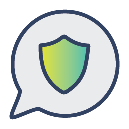
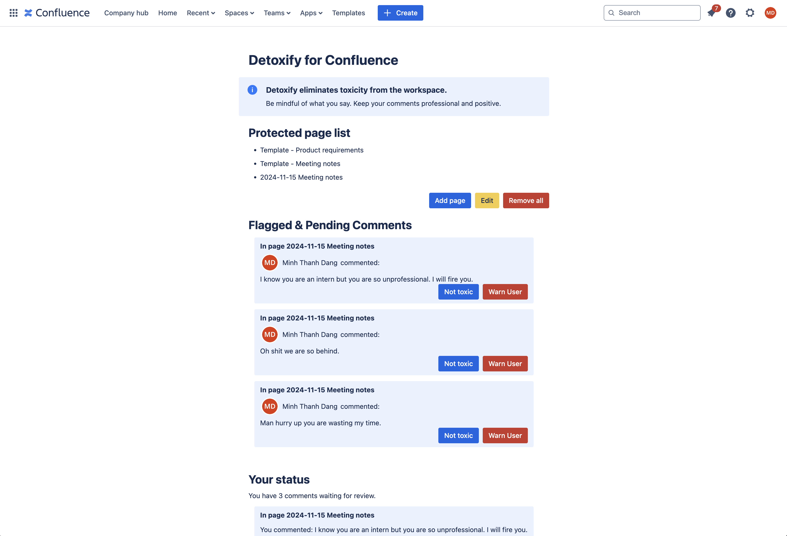
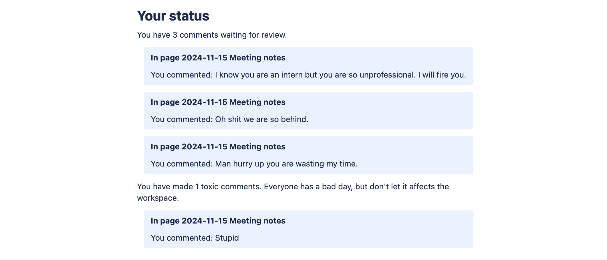

## Detoxify for Confluence 


### Table of content

**[1) Introduction](#introduction)**

**[2) Features](#features)**

**[3) Installation & Configuration](#installation--configuration)**

**[4) Usage](#usage)**

**[5) App Logic](#app-logic)**

**[6) About our AI model](#about-our-ai-model)**

**[7) Final words](#final-words)**


### Introduction

  Built with the Forge platform, **Detoxify** is a powerful Confluence app designed to enforce and encourage a healthier and more productive workspace. By detecting and flagging toxic comments in real-time, Detoxify ensures that team discussions remain respectful and inclusive.

  Inspiration: A toxic workspace is detrimental to your mental health. Tension between team members reduce productivity and collaboration. This happens a lot, especially in stressful environments like software development. That's why I built Detoxify.

  This app was built as an entrant of Atlassian Codegeist Hackathon 2024.


  
  <div align="center">
    Figure 1. Admin View
  </div>

### Features
  ##### 1. Accurate toxic comment detection
  Powered by the cutting-edge [BERT AI model](#about-our-ai-model), trained on hundreds of thousands of examples, Detoxify excels at analyzing the tone and context of comments to identify toxicity with high precision.
  ##### 2. Immediate Action against Toxic Comments
  As soon as a toxic comment is detected, Detoxify flags and removes it in near real-time, preventing possible disruption in the workplace.

### Installation & Configuration
  **1.** Prerequisites:
You must have an Atlassian account and be a Confluence Admin on a site. Log in into that admin account.

  **2.** Click on this [distribution link](https://developer.atlassian.com/console/install/741851e5-fe02-4b74-87d2-e420f64649b5?signature=AYABeIX4fNuy1qjUBCNV1OlqPKYAAAADAAdhd3Mta21zAEthcm46YXdzOmttczp1cy1lYXN0LTE6NzA5NTg3ODM1MjQzOmtleS83ZjcxNzcxZC02OWM4LTRlOWItYWU5Ny05MzJkMmNhZjM0NDIAuAECAQB4KVgoNesMySI2pXEz4J5S%2B4but%2FgpPvEEG0vL8V0Jz5cB350bZUo1mJW79gY1w7Hs2QAAAH4wfAYJKoZIhvcNAQcGoG8wbQIBADBoBgkqhkiG9w0BBwEwHgYJYIZIAWUDBAEuMBEEDJOwithntCHQHQl0ewIBEIA7QMRC1S62v50CFOcM7OTzf5Xf8SiE%2BKYp5expuL90JOl2lPm4bUKOgc2qSKrpzk4UvlWZhdszAphv%2Bn4AB2F3cy1rbXMAS2Fybjphd3M6a21zOmV1LXdlc3QtMTo3MDk1ODc4MzUyNDM6a2V5LzU1OWQ0NTE2LWE3OTEtNDdkZi1iYmVkLTAyNjFlODY4ZWE1YwC4AQICAHig7hOcRWe1S%2BcRRsjD9q0WpZcapmXa1oPX3jm4ao883gGixWzfXEa5a9mVoxWKgXUxAAAAfjB8BgkqhkiG9w0BBwagbzBtAgEAMGgGCSqGSIb3DQEHATAeBglghkgBZQMEAS4wEQQMn4BRX0vIP7t0cPz%2BAgEQgDtSyWEtkyd3qIZHvlyc0N%2BUYMCZ6KefGVa5KhcD%2FeWCDSrmX1el%2FJ8v6CWBzDFYUUYBRy%2BEVt95k5BUkwAHYXdzLWttcwBLYXJuOmF3czprbXM6dXMtd2VzdC0yOjcwOTU4NzgzNTI0MzprZXkvM2M0YjQzMzctYTQzOS00ZmNhLWEwZDItNDcyYzE2ZWRhZmRjALgBAgIAeBeusbAYURagY7RdQhCHwxFswh7l65V7cwKp%2BDc1WGoHAffUUMaDjKX9xeFfhqq0VIEAAAB%2BMHwGCSqGSIb3DQEHBqBvMG0CAQAwaAYJKoZIhvcNAQcBMB4GCWCGSAFlAwQBLjARBAzX8bEtcKL77BL2lM4CARCAOySIM5a%2BkhjYi2kwubE%2FXiDzjV2vuj7HxZU3BxoufugdjsmQfRYsnqoET2Ju8JPhafkJRApsKpBoIydBAgAAAAAMAAAQAAAAAAAAAAAAAAAAAMBje8LY%2BtOzq6HEukIuCAz%2F%2F%2F%2F%2FAAAAAQAAAAAAAAAAAAAAAQAAADIUnxPT3rNFQ2lC1RmWN%2BlAqEUnwFkOZRcH0D6smCeP1rw0%2FjxXyfdN8wbsynUCLFrH%2BP0uUjKefovcPOgWUMALVqY%3D&product=confluence) and follow the instructions to install the app.

  **3.** Once the app is installed, go to ```Confluence Administration Settings``` (located at the top right corner) -> ```Apps``` (Left panel) -> ```Detoxify Global Settings```. Enter the account ID of the Admin you want to assign (You can find your account ID by clicking on your ```Avatar```(top right) -> ```Profile```. Your account ID is in the URL after ```people/```). You don't need an API Key right now, and the API endpoint is open for anyone, as I can't find the policy to share the API Key for the Codegeist 2024 Hackathon. The API URL has been configured in the environment variable. Click ```Submit``` to save, make sure to wait for the confirmation notification before closing the page.

  
  <div align="center">
    Figure 2. Admin Global Settings Page
  </div>

### Usage
  **1.** As the Admin, you can configure which Confluence page to protect. Go to Confluence, select Apps dropdown on the navigation bar, and choose ```Detoxify for Confluence```. Under ```Protected Page List```, click ```Add page```. Choose the pages you want, then click ```Submit```. Now the app will check every inline comments and footer comments on these pages and flag toxic comments.

  **2.** Toxic comments will be shown in the admin view of the app. The Admin can review and decide if the comment is toxic or our AI got it wrong. Every users (including the Admin) can see which of their comments are being flagged / are confirmed as toxic.
  
  <div align="center">
    Figure 3. App Non-Admin View
  </div>

### App Logic

#### Confluence Trigger Logic
 - The user uploads a comment. This triggers the "avi:confluence:created:comment" event.
 - When Detoxify receives the event, it checks if the comment is from a protected page. If no, Detoxify skips the comment. If yes, Detoxify gets, strips (HTML tags and emojis), and passes the comment content to the API Gateway endpoint.
 - The validateComment service is serverless. Lambda will load the python libraries and our fine-tuned BERT classification model for inference. The returned result is "yes" or "no".
 - If the comment is not toxic, nothing happens. Otherwise, Detoxify stores the comment (authorId, content, and pageId) using Forge Storage API. 
 - The flagged comments are then shown in the Admin view, so the Admin can manually review and warn users. In the User view, everyone will see their own toxic comments warning.

#### Storage
 - Flagged Comments Metadata and Content are stored using the Storage API Custom Entity Store.
 - Admin ID is stored using Key-Value Store.


### About our AI Model
##### 1. Model Architecture
We adapt BERT to create a simple classification model. Check out the [training notebook](/model/train.ipynb).

<div align="center">
  Figure 4. Model Architecture
</div>

##### 2. Training datasets
- [Hate Speech Detection curated Dataset](https://www.kaggle.com/datasets/waalbannyantudre/hate-speech-detection-curated-dataset)
- [Code Review Dataset](https://github.com/WSU-SEAL/ToxiCR/blob/master/models/code-review-dataset-full.xlsx)
- [Toxic Comment Classification Challenge Dataset](https://www.kaggle.com/competitions/jigsaw-toxic-comment-classification-challenge/data)
 
##### 3. Deployment
We deployed the AI Model on **AWS** using ```EFS```, ```Lambda```, and ```API Gateway```. Since request will mostly be made only during a short period of judging time, I came to the conclusion that dedicating a separate server with GPU is too expensive compared to the following serverless architecture.

<div align="center">
  Figure 5. AWS Architecture
</div>

##### 4. Try it yourself!
Download the model state dict [here](https://drive.google.com/file/d/1MTtqHVIz65AIKMUkCsfDA1OJxQxa-s-A/view?usp=drive_link), and run the model [inference notebook](/model/inference.ipynb). Make sure to change the `load_state_dict` directory to where the state dict is saved.

### Final words
I sincerely thank the organizers and sponsors of Codegeist 2024, namely Atlassian, AWS, and Devpost, for providing us with this incredible opportunity. I learnt a lot during the journey, about the Atlassian developer platform Forge, the capabilities of many Atlassian products, and about the existing apps running on the platform. Such a great Hackathon experience!
